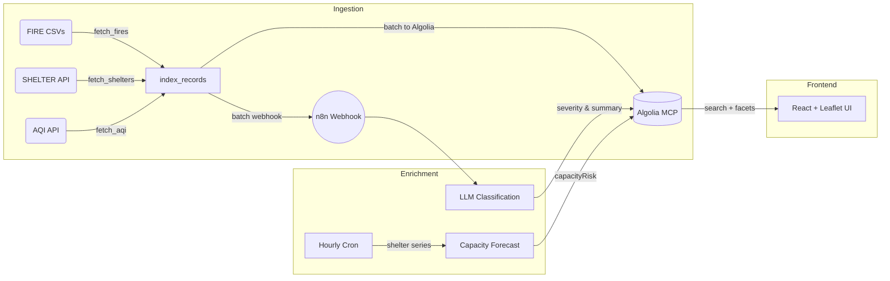

# EmberAI

An open‑source, AI‑powered mapping dashboard for tracking wildfires and shelter
locations in real time.

EmberAI combines lightning‑fast search with meaningful AI insights to equip
communities, first responders, and volunteers with the information they need to
act quickly during fire emergencies.

---

## 🚀 Key Features

- **Geo‑Aware Search with Algolia MCP**

  - Unified proxy for multiple indices (`fires`, `shelters`, `aqi`).
  - Instant **insideBoundingBox** filtering for map viewport queries.
  - High‑performance faceting (e.g. `severity:4+`, `state:CA`).

- **AI Enrichment via n8n Workflows**

  - **Fire Severity Classification**: Automated LLM calls convert raw satellite
    data into a 1–5 urgency score and one‑sentence summary.
  - **Shelter Capacity Forecasting**: Time‑series API + LLM or ARIMA predicts
    near‑future capacity risks (boolean flag).
  - Modular workflows in n8n—no additional server code required.

- **Real‑Time Data Ingestion**

  - **MODIS / VIIRS** fire data from NASA FIRMS (7‑day CSV feeds).
  - **FEMA** shelter locations via open data API.
  - Optional **Air Quality Index (AQI)** from AirNow.
  - Secure, batch indexing into Algolia with a Python pipeline
    (`update_indices.py`).

- **Interactive Map UI**

  - React + Leaflet front‑end with colored circle markers: scale up severity
    from green→purple.
  - Popups display date, confidence, AI summary, and capacity forecasts.
  - Search bar for date, confidence, and full‑text queries.
  - Responsive design for desktop and tablet use.

---

## 📦 Getting Started

Follow these steps to run EmberAI locally. No paid hosting or accounts required.

### 1. Clone the repository

```bash
git clone https://github.com/your‑org/emberai‑dashboard.git
cd emberai‑dashboard
```

### 2. Configure environment

Create a `.env` file based on `.env.example`:

```bash
cp .env.example .env
```

Fill in at minimum:

```ini
ALGOLIA_APP_ID=your_algolia_app_id
ALGOLIA_ADMIN_KEY=your_algolia_admin_key
# Optional (for AQI): AIRNOW_API_KEY=your_airnow_api_key
# Optional (for severity workflows): OPENAI_API_KEY=your_openai_api_key
# n8n Webhook URL: "http://n8n:5678/webhook/fire-severity"
N8N_FIRE_WEBHOOK_URL=http://n8n:5678/webhook/fire-severity
```

### 3. Launch with Docker Compose

```bash
docker-compose up --build -d
```

Services:

- **backend** (Python indexer + Algolia MCP proxy on port 4000)
- **frontend** (React UI on port 5173)
- **n8n** (AI workflow engine on port 5678)

### 4. Run initial data ingest

```bash
docker-compose exec backend python /app/update_indices.py
```

### 5. Access the dashboard

- UI: [http://localhost:5173](http://localhost:5173)
- n8n Editor: [http://localhost:5678](http://localhost:5678) (no signup or
  payment required)

---

## 📈 Architecture Overview



---

## 🤝 Contributing & Next Steps

I welcome contributions to:

- Add regional filters and custom alerts (e.g. SMS/email hooks).
- Integrate reverse‑geocoding for human‑readable locations.
- Enhance UI/UX with chart overlays and data exports.

Let's build stronger wildfire response tools together! 🌍🔥
